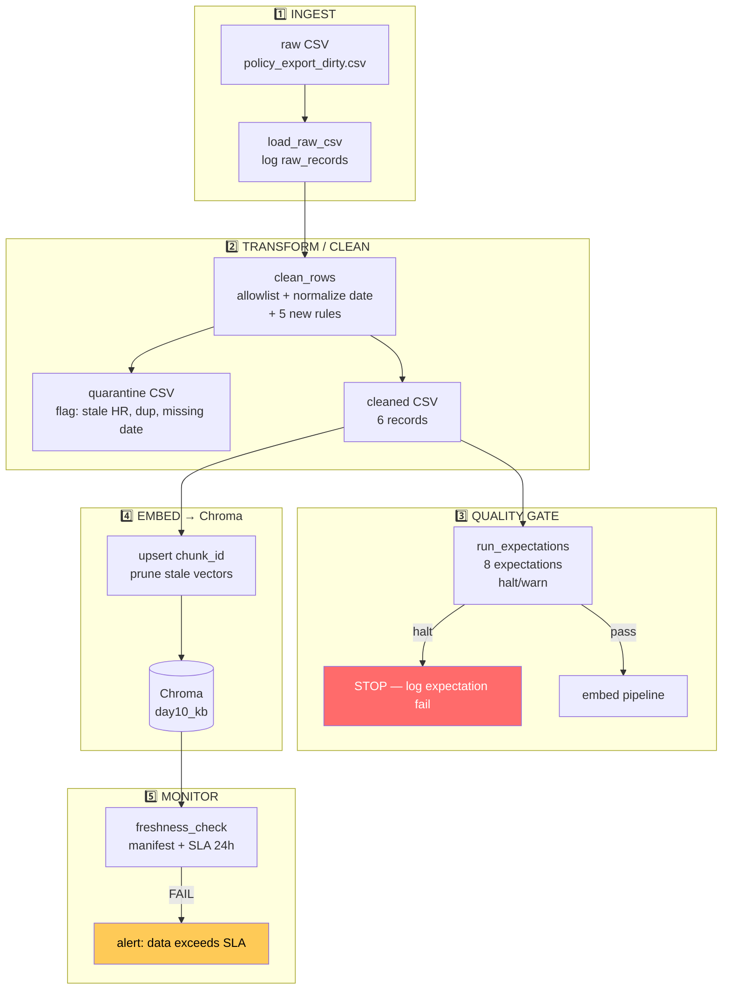

# Kiến trúc pipeline — Lab Day 10: Data Pipeline & Data Observability

**Nhóm:** Lab03-Day10-Team
**Thành viên:** 4 người (phân vai chi tiết trong group_report.md)
**Cập nhật:** 2026-04-15

---

## 1. Sơ đồ luồng (Mermaid)

**Điểm đo Freshness:** tại `latest_exported_at` trong manifest — sau bước **publish** (embed hoàn tất), không phải tại ingest.

**run_id:** ghi ở mọi bước — log, cleaned CSV, quarantine CSV, manifest JSON, Chroma metadata.

---

## 2. Ranh giới trách nhiệm

| Thành phần | Input | Output | Owner nhóm |
|------------|-------|--------|------------|
| **Ingest** | `data/raw/policy_export_dirty.csv` | `rows[]` logged với `raw_records=10` | Ingestion Owner |
| **Transform/Clean** | `rows[]` | `cleaned[]` (6 rows) + `quarantine[]` (4 rows) — baseline 6 rules + 5 new rules | Cleaning / Quality Owner |
| **Quality Gate** | `cleaned[]` | 8 expectations (6 baseline + 2 new); PASS/FAIL logged | Cleaning / Quality Owner |
| **Embed** | `cleaned CSV` | Chroma `day10_kb` collection; `embed_upsert count=6` | Embed / Idempotency Owner |
| **Monitor** | `manifest JSON` | PASS/WARN/FAIL + `age_hours`; ghi vào log | Monitoring / Docs Owner |

---

## 3. Idempotency & rerun

**Strategy:** upsert theo `chunk_id` ổn định (SHA256 hash của `doc_id|chunk_text|seq`).

- **Rerun 2 lần:** vector count không tăng (chỉ update metadata).
- **Prune:** sau mỗi `run`, xoá các `chunk_id` không còn trong cleaned run hiện tại → tránh vector "mồi cũ" (stale chunk) làm fail grading.
- **Embed thực tế:** log ghi `embed_prune_removed=N` — nếu N=0 ở lần thứ 2 → idempotent đúng.

**Evidence:** `run_sprint1-clean` → embed 6 vectors. `run_sprint2-clean` → embed 6 vectors (upsert, không duplicate), prune 6 vector cũ → net unchanged.

---

## 4. Liên hệ Day 09

Pipeline Day 10 cung cấp vector index cho RAG retrieval trong Day 09:

- **Collection:** `day10_kb` (tách khỏi `day09_kb` của lab trước).
- **Cùng corpus:** 5 docs trong `data/docs/*.txt` — cùng nội dung CS + IT Helpdesk.
- **Feed agent:** sau mỗi `etl_pipeline.py run`, vector store được cập nhật → agent Day 09 truy vấn corpus đã được clean + validate.
- **Validation:** `eval_retrieval.py` đo bằng keyword matching trên top-k retrieval — tương đương cách agent đánh giá context.

---

## 5. Rủi ro đã biết

| Rủi ro | Mức độ | Mitigation |
|--------|--------|------------|
| CSV export có BOM UTF-8 → embed vector sai | Thấp | Rule `_strip_bom` đã loại ở bước clean |
| Export từ hệ thống cũ chứa version policy stale (14 ngày) | Cao | `refund_no_stale_14d_window` halt expectation + fix tự động |
| HR policy 2025 (10 ngày) còn trong export | Cao | `stale_hr_policy_effective_date` quarantine rule + expectation E6 |
| Data mẫu có `exported_at = 2026-04-10` → freshness FAIL | Được thiết kế | Đây là design hợp lý — data cũ 5 ngày > SLA 24h. GV ghi rõ "FAIL là hợp lệ" |
| Inject `--no-refund-fix` vẫn embed stale chunk nếu `--skip-validate` | Cố ý | Chỉ dùng cho demo Sprint 3; runbook ghi rõ cách restore |
